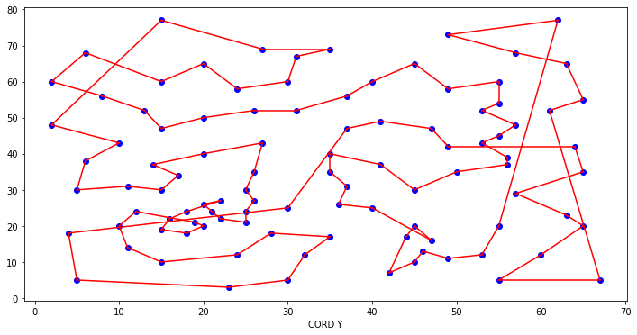

# Nearest-neighbor-algoritm

  El problema del viajante de comercio (TSP) es un problema algorítmico encargado de encontrar 
  la ruta más corta entre un conjunto de puntos y ubicaciones que deben visitarse.
  Se suele usar la siguiente analogía para describirlo:
  "Imagine que un vendedor ambulante tiene que ir a todas las ciudades de una región para poder 
  vender sus productos, el vendedor quiere recorrer todas las ciudades y volver a su origen 
  haciendo el menor recorrido posible."

  Se usa a menudo en informática para encontrar la ruta más eficiente para que los datos viajen 
  entre varios nodos. Las aplicaciones incluyen la identificación de métodos de optimización de 
  redes o hardware.
  En lugar de centrarse en encontrar la ruta más eficaz, TSP a menudo se preocupa por encontrar 
  la solución más económica. En los TSP, la gran cantidad de variables crea un reto a la hora de 
  encontrar la ruta más corta, lo que hace más atractivas las soluciones aproximadas, rápidas y 
  económicas.

# Descripción del algoritmo.

  En ese problema, el vendedor comienza en una ciudad al azar y visita repetidamente la ciudad 
  más cercana hasta que haya visitado todas. El algoritmo produce rápidamente un recorrido 
  corto, pero por lo general no es el óptimo.

Los pasos para elaborar el algoritmo son:

<ol>

  <li value="1">Inicializar los vértices no visitados. </li>

  <li>Elegir un vértice aleatorio (U) , en este vértice se empezará. </li>

  <li> Encuentre el borde mas corto que conecta al vértice U con un vértice no visitado (V). </li>

  <li> Establezca como U el ultimo vértice V. Marcando V como visitado. </li>

  <li> Repetir desde el paso 3 hasta haber terminado con todos los vértices del dominio. </li>

  <li> Volver al vértice inicial.  </li>

</ol>

# Modelo matemático.

Función objetivo:

  

Restricciones:

  

  Ruta para 5 nodos:

  

Ruta para 48 nodos:

  

Ruta para 101 nodos:

  

